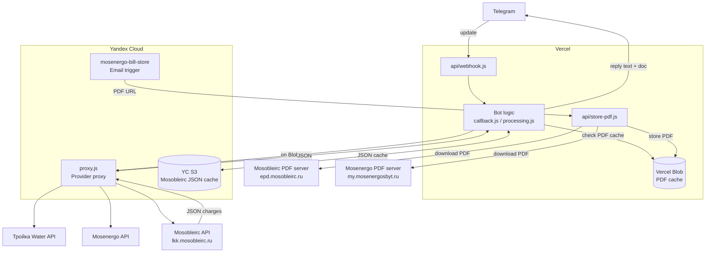
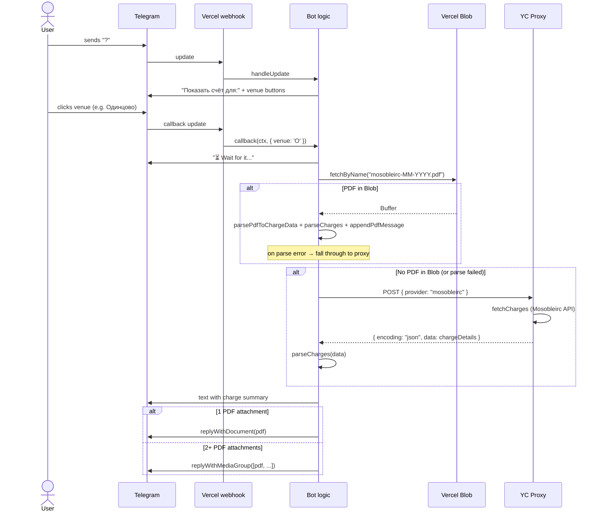
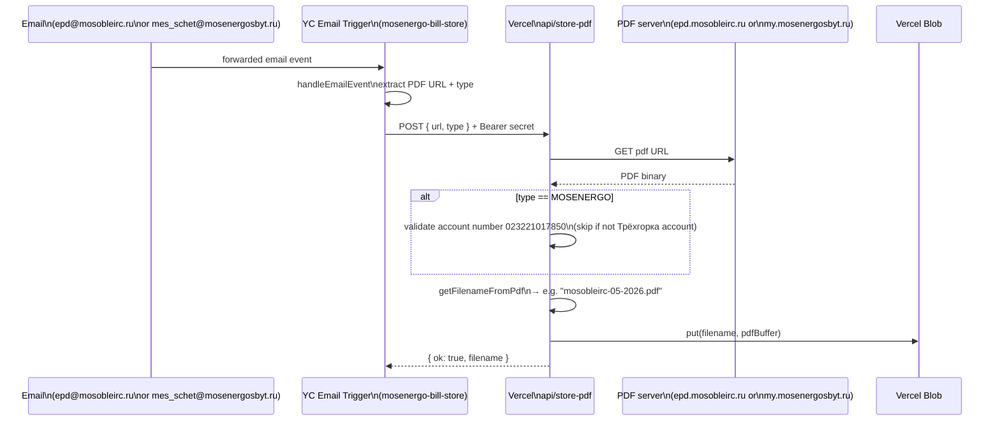

# Bot Workflow

## Overview

The bot is split across two runtimes: **Vercel** hosts the Telegram webhook and user-facing logic, and **Yandex Cloud (YC)** runs the provider-fetching proxy that reaches Russian utility APIs from a Russian IP. **Vercel Blob** acts as a shared PDF cache between the two.

---

## System Architecture

---

## Venues and Providers

| Venue button | Code | Providers fetched |
|---|---|---|
| Одинцово | `O` | Mosobleirc |
| Трёхгорка | `T` | Water, Electricity |
| *(both)* | DEFAULT | Water, Electricity, Mosobleirc |

---

## User Interaction Flow

---

## PDF Ingestion Flow

PDFs for Mosobleirc and Mosenergo (electricity) arrive by email and are stored in Vercel Blob so the bot can attach them to replies.

---

## Caching Strategy

| Provider | Cache location | Key format | Populated by |
|---|---|---|---|
| Water | Vercel Blob | `water-MM-YYYY.pdf` | Proxy response (fire-and-forget) |
| Electricity | Vercel Blob | `electricity-MM-YYYY.pdf` | Proxy response (fire-and-forget) |
| Mosobleirc PDF | Vercel Blob | `mosobleirc-MM-YYYY.pdf` | Email trigger → `store-pdf` |
| Mosobleirc charges | YC S3 | `mosobleirc.json` → `{ "MM-YYYY": [...] }` | Direct API fetch (fallback) |

The current billing period key is always the **previous calendar month** (e.g. in June 2026 → `05-2026`).

---

## Environment Variables

| Variable | Runtime | Purpose |
|---|---|---|
| `BOT_TOKEN` | Vercel | Telegram bot token |
| `YC_PROXY_URL` | Vercel | Full URL of the YC proxy function; if unset the bot fetches providers directly |
| `STORE_PDF_SECRET` | Vercel + YC | Shared Bearer token protecting `api/store-pdf` |
| `VERCEL_STORE_PDF_URL` | YC | Full URL of `api/store-pdf` on Vercel |
| `BLOB_READ_WRITE_TOKEN` | Vercel | Vercel Blob access token |
| `MOSOBL_ACCOUNT` | YC | Mosobleirc account number |
| `MOSOBL_TENANT_TOKEN` | YC | Mosobleirc tenant auth token |
| `MESSAGE_FORMAT` | Vercel | `compact` (default) or `detailed` reply format |
| `REQUEST_TIMEOUT` | YC | Timeout in ms for provider HTTP requests |
